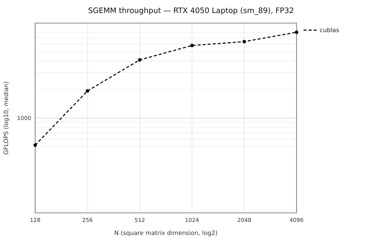

# sgemm-cuda

A staged CUDA SGEMM optimization study on an RTX 4050 Laptop GPU, benchmarked against
cuBLAS. Every rung of the ladder stays in the repo - compiled, correctness-checked and
measured side by side - because the progression is the point, not the final kernel.

Row-major, square, FP32: `C = A · B` with A, B, C all N×N, α=1, β=0.

**Status: K0 and K1 done. K2–K5 not yet implemented.** Every number below was measured on
this machine; nothing is estimated or carried over from a reference writeup.

**Headline (N=4096):** K1 reaches **511.5 GFLOPS**, a **4.94× speedup over the naive
kernel** and 6.5% of cuBLAS. The coalescing change alone is worth up to **9.99×** (N=512).

---

## Quick start

```bash
cmake -S . -B build -DCMAKE_BUILD_TYPE=Release
cmake --build build -j

./build/sgemm --kernel 1 --size 4096     # one kernel, one size
./bench/sweep.sh                         # regenerates every number below
```

`sweep.sh` builds, records device properties, starts the clock logger, sweeps every
kernel × every size, and renders the results table and chart into `results/`.

---

## Hardware

|                              |                                                           |
| ---------------------------- | --------------------------------------------------------- |
| GPU                          | NVIDIA GeForce RTX 4050 Laptop GPU (Ada AD107), 140 W TGP |
| Compute capability           | 8.9 (`-arch=sm_89`)                                       |
| SMs / max threads per SM     | 20 / 1536                                                 |
| Shared memory per block / SM | 49152 B (101376 opt-in) / 102400 B                        |
| Registers per SM             | 65536                                                     |
| L2 cache                     | 24576 KiB                                                 |
| Memory bus                   | 96-bit @ 8001 MHz → 192.0 GB/s theoretical                |
| Driver / CUDA                | 610.47 / 13.3 runtime 13.0 (nvcc V13.0.88)                |
| OS                           | Ubuntu 24.04 on WSL2                                      |

Full dump: [`results/device_query.txt`](results/device_query.txt).

---

## How these numbers were measured

- **Timing:** `cudaEvent_t` around the kernel launch only - allocation and H2D/D2H are
  outside the measured region. 5 discarded warm-up iterations, then 50 timed, **median**
  reported. Min and p95 are in the CSV so variance is visible.
- **Baseline:** cuBLAS with `cublasSetMathMode(handle, CUBLAS_DEFAULT_MATH)`, so it runs
  **true FP32 and not TF32 tensor cores** - otherwise the comparison would be against a
  different instruction path. cuBLAS is column-major, so row-major `C = A·B` is obtained
  by computing `Cᵀ = Bᵀ·Aᵀ` (operands passed B first, then A).
- **Correctness:** every run is checked against cuBLAS and must satisfy
  `max|C − C_ref| / max|C_ref| < 1e-3`. Bitwise equality is not achievable in general -
  a different summation order changes FP32 rounding.
- **Compilation:** `-O3 -lineinfo --ptxas-options=-v`. **No `--use_fast_math`** - it
  changes numerics and would make the comparison dishonest.
- **Inputs:** fixed seeds (1234 for A, 1235 for B), `std::mt19937`, uniform [-1, 1).

Throughput is `GFLOPS = (2 · N³) / seconds / 1e9`.

**"% of cuBLAS" is the headline rather than raw TFLOPS** because this is a 140 W laptop
part: absolute throughput moves with clock and thermal state, but the kernel and cuBLAS
throttle together, so the ratio survives that variation. `bench/clocks.sh` logs SM clock,
power and temperature at 1 Hz alongside every sweep.

---

## Results

Single `./bench/sweep.sh` run, 5 warm-up + 50 timed iterations, median. Raw data in
[`results/results.csv`](results/results.csv).

### GFLOPS

| Kernel         | N=128 | N=256  | N=512  | N=1024 | N=2048 | N=4096 |
| -------------- | ----- | ------ | ------ | ------ | ------ | ------ |
| `K0_naive`     | 57.0  | 62.2   | 77.4   | 102.4  | 103.7  | 103.5  |
| `K1_coalesced` | 315.1 | 455.1  | 773.3  | 787.5  | 794.3  | 511.5  |
| `cublas`       | 455.1 | 1820.4 | 3855.1 | 7489.8 | 7951.3 | 7891.0 |

### % of cuBLAS

| Kernel         | N=128 | N=256 | N=512 | N=1024 | N=2048 | N=4096 |
| -------------- | ----- | ----- | ----- | ------ | ------ | ------ |
| `K0_naive`     | 12.5% | 3.4%  | 2.0%  | 1.4%   | 1.3%   | 1.3%   |
| `K1_coalesced` | 69.2% | 25.0% | 20.1% | 10.5%  | 10.0%  | 6.5%   |

### Speedup over K0 naive

| Kernel         | N=128 | N=256  | N=512  | N=1024 | N=2048 | N=4096 |
| -------------- | ----- | ------ | ------ | ------ | ------ | ------ |
| `K1_coalesced` | 5.53× | 7.32×  | 9.99×  | 7.69×  | 7.66×  | 4.94×  |
| `cublas`       | 7.98× | 29.28× | 49.83× | 73.14× | 76.65× | 76.25× |



### Correctness and register usage

| Kernel         | max rel err (N=128 → 1024) | max rel err (N=2048, 4096) | Registers | Spills |
| -------------- | -------------------------- | -------------------------- | --------- | ------ |
| `K0_naive`     | 4.17e-07 → 1.38e-06        | 0                          | 34        | none   |
| `K1_coalesced` | 4.17e-07 → 1.38e-06        | 0                          | 36        | none   |

The error being _exactly_ zero at the two largest sizes is a real bitwise match with
cuBLAS, not a skipped check - cuBLAS switches its k-reduction strategy above N≈1650 and
lands on the same summation order these kernels use.

### GPU state during the sweep

107 samples at 1 Hz, from [`results/clocks.csv`](results/clocks.csv):

|                  | min  | median | max  |
| ---------------- | ---- | ------ | ---- |
| SM clock (MHz)   | 2055 | 2700   | 2715 |
| Power (W)        | 15.6 | 45.0   | 89.3 |
| Temperature (°C) | 48   | 61     | 71   |

The part held near its maximum clock throughout and peaked at 89.3 W against a 140 W cap,
so nothing above is a throttling artifact.

---

## The ladder

|     | Kernel                                                               | Status  |
| --- | -------------------------------------------------------------------- | ------- |
| K0  | naive — one thread per output element, `threadIdx.x` selects the row | done    |
| K1  | global memory coalescing — remap so `threadIdx.x` selects the column | done    |
| K2  | shared memory tiling                                                 | planned |
| K3  | 1D blocktiling / thread coarsening                                   | planned |
| K4  | 2D register blocktiling                                              | planned |
| K5  | vectorized `float4` loads                                            | planned |

**K1 is the same arithmetic as K0 with one change: the thread-to-element map.** Consecutive
`threadIdx.x` land on consecutive columns, so a warp reads 32 contiguous floats of B - one
128-byte transaction instead of 32 - and writes C contiguously, while its read of A
collapses to a single broadcast address. That is worth 5.53×–9.99× for 2 extra registers
and no spills.

`K1 regresses at N=4096` (794.3 → 511.5 GFLOPS).

---

## Reproducing

```bash
./bench/sweep.sh
```

Regenerates `results/results.csv`, `results/clocks.csv`, `results/results_table.md`,
`results/gflops_vs_n.svg` and `results/device_query.txt`. Overridable via environment:

```bash
WARMUP=10 ITERS=100 SIZES="1024 4096" KERNELS="cublas 1" ./bench/sweep.sh
```

For numbers worth quoting, close anything else using the GPU - under WSL2 the Windows
desktop compositor can preempt compute work, and a hardware-accelerated browser holds VRAM
even while idle.
